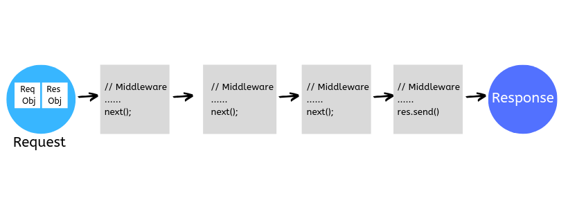

# Day 3: Express.js Basics

## Overview

Express.js is a fast, unopinionated, and minimalist web framework for Node.js. It simplifies the process of building web applications and APIs by providing a robust set of features for routing, middleware, and handling HTTP requests and responses.

## Routes

Routes in Express.js define how your application responds to client requests for specific endpoints (URIs) and HTTP methods (GET, POST, etc.).

```js
app.get('/path', (req, res) => {    
    res.send('Response for GET request to /path');
});
```

Available HTTP methods include:

- `app.get()`
- `app.post()`
- `app.put()`
- `app.delete()`
- `app.patch()`
- `app.all()` - to handle all HTTP methods

### Express Router

Express Router is a mini Express application that can be used to organize your routes. It helps in modularizing your code by separating routes into different files.

```js
// posts.js
const express = require('express');
const router = express.Router();

router.get('/', (req, res) => {
    res.send('Response for GET request to /posts');
});

export default router;
```

Then, in your main application file, you can use the router:

```js
import express from 'express';
import postsRouter from './posts.js';

const app = express();

app.use('/posts', postsRouter);

app.listen(3000, () => {
    console.log('Server is running on port 3000');
});
```

## Middleware



Middleware functions are functions that have access to the request object (`req`), the response object (`res`), and the next middleware function in the application’s request-response cycle.The next middleware function is commonly denoted by a variable named `next`

Middleware can perform the following tasks:

- Execute any code.
- Make changes to the request and response objects.
- End the request-response cycle.
- Call the next middleware function in the stack.

If the current middleware function does not end the request-response cycle, it must call `next()` to pass control to the next middleware function. Otherwise, the request will be left hanging.

There are several types of middleware in Express.js:

- **Application-level**
- **Router-level**
- **Error-handling**
- **Built-in**
- **Third-party**

### Application-level

Bound to an instance of `express()`, by using `app.use()` and `app.METHOD()`.

This example shows a middleware function with no mount path. The function is executed every time the app receives a request.

```js
app.use((req, res, next) => {
    console.log('Request received');
    next();
});
```

For more specific routes:

```js
app.use('/user/:id', (req, res, next) => {
    console.log('Request Type:', req.method);
    next();
});
```

> 📚 For more information on Application-level middleware, check the [documentation](https://expressjs.com/en/guide/using-middleware.html#middleware.application).

### Router-level

Bound to an instance of `express.Router()`. Works the same way as application-level middleware, except it is bound to an instance of `express.Router()`.

```js
import express from 'express';

const router = express.Router();

router.use((req, res, next) => {
    console.log('Request received at router level');
    next();
});

export default router;
```

> 📚 For more information on Router-level middleware, check the [documentation](https://expressjs.com/en/guide/using-middleware.html#middleware.router)

### Error-handling

Error-handling middleware functions have four arguments instead of three: `(err, req, res, next)`. You must provide four arguments to identify it as an error-handling middleware function. Even if you don’t need to use the `next` object, you must specify it to maintain the signature.

```js
app.use((err, req, res, next) => {
    console.error(err.stack);
    res.status(500).send('Something broke!');
});
```

> 📚 For more information on Error-handling middleware, check the [documentation](https://expressjs.com/en/guide/using-middleware.html#middleware.error-handling).

### Built-in

Express comes with a few built-in middleware functions, such as `express.static`, `express.json`, and `express.urlencoded`.

```js
app.use(express.json()); // for parsing application/json
```

> 📚 For more information on Built-in middleware, check the [documentation](https://expressjs.com/en/guide/using-middleware.html#built-in-middleware).

### Third-party

Third-party middleware functions are created by the community and can be installed via npm. Examples include `body-parser`, `cors`, and `morgan`.

```js
import cors from 'cors';
app.use(cors()); // Enable CORS for all routes
```

> 📚 For more information on Third-party middleware, check the [documentation](https://expressjs.com/en/guide/using-middleware.html#middleware.third-party).

## Response Methods

The methods on the response object (res) in the following table can send a response to the client, and terminate the request-response cycle. If none of these methods are called from a route handler, the client request will be left hanging.

| Method               | Description                                         |
|----------------------|-----------------------------------------------------|
| `res.download()`    | Prompts a file download.                            |
| `res.end()`         | Ends the response process without any data.         |
| `res.json()`        | Sends a JSON response.                              |
| `res.jsonp()`       | Sends a JSONP response.                             |
| `res.redirect()`    | Redirects the client to a different URL.            |
| `res.render()`      | Renders a view template.                            |
| `res.send()`         | Sends a response of various types (string, object, buffer, etc.). |
| `res.sendFile()`    | Sends a file as an octet stream.                    |
| `res.sendStatus()`      | Set the response status code and send its string representation as the response body. |

## REST API

> 📚 For a detailed understanding of RESTful API design, refer to this great [course](https://www.restapitutorial.com/).

REST (Representational State Transfer) is an architectural style for designing networked applications. A RESTful API uses HTTP requests to perform CRUD (Create, Read, Update, Delete) operations on resources.

REST APIs has set of rules, and they are:

- **Uniform Interface**: Resources are identified by URIs, and interactions are performed using standard HTTP methods.
- **Stateless**: Each request from a client to a server must contain all the information needed to understand and process the request. The server does not store any client context between requests.
- **Client-Server Architecture**:
  - The client and server are separate entities that communicate over a network.
  - Servers are not concerned with the user interface or user state, so that servers can be simpler and more scalable.
  - Servers and clients may also be replaced and developed independently, as long as the interface is not altered.
- **Cacheable**: Responses must define themselves as cacheable or non-cacheable to improve performance.
- **Layered System**:
  - Layers can be added between the client and server to improve scalability and manageability, like load balancers, proxies, and gateways.
  - Each layer cannot see beyond the immediate layer they are interacting with.
- **Code on Demand (optional)**: Servers can extend client functionality by sending executable code (like JavaScript) to the client.

An API that adheres to the principles of REST is called a RESTful API.

The term is used very loosely and in today's internet world, RESTful almost always means an  HTTP-based API.  That means it operates in a request-response fashion over HTTP, usually using JSON as the data format in the request and response bodies.

### Important Tips for Designing RESTful APIs

- Organize your API endpoints around resources (nouns) rather than actions (verbs).
- Use plural nouns for resource names (e.g., `/users`, `/posts`).
- Use HTTP methods to indicate the action to be performed on the resource.
- Support filtering, sorting, and pagination for collections of resources, using query params.
- Use lower-case in URL segments, separating words with underscores (’_’) or hyphens (’-’)

```js
GET /users        - Retrieve a list of users
POST /users       - Create a new user
GET /users/:id    - Retrieve a specific user
PUT /users/:id    - Update a specific user
DELETE /users/:id - Delete a specific user

// nested resources
GET /users/:userId/posts       - Retrieve posts for a specific user
POST /users/:userId/posts      - Create a post for a specific user
GET /users/:userId/posts/:postId - Retrieve a specific post for a specific user
PUT /users/:userId/posts/:postId - Update a specific post for a specific user
DELETE /users/:userId/posts/:postId - Delete a specific post for a specific user

// filtering, sorting, and pagination
GET /users?age=25               - Filter users by age
GET /users?sort=name            - Sort users by name
GET /users?page=2&limit=10      - Paginate users (page 2, 10 users per page)
```

- Use appropriate HTTP status codes to indicate the result of the operation.

| Status Code | Description                        |
|-------------|------------------------------------|
| 200 OK      | The request was successful.        |
| 201 Created | A new resource was successfully created. Often used for POST and PUT requests. |
| 204 No Content | The request was successful, but there is no content to return. often used for DELETE and PUT requests. |
| 400 Bad Request | The request was invalid or cannot be served. |
| 401 Unauthorized | Authentication is required and has failed or has not yet been provided. |
| 403 Forbidden |  the user is not authorized to perform the operation or the resource is unavailable for some reason |
| 404 Not Found | The requested resource could not be found. |
| 409 Conflict | The request could not be completed due to a conflict with the current state of the resource. |
| 500 Internal Server Error | An error occurred on the server side. |

## Sending Data over HTTP

When sending data over HTTP, there are several common methods to include data in requests. The most common methods are query parameters, path parameters, and request bodies.

### Query Parameters

Query parameters are appended to the URL after a question mark (`?`) and are used to send small amounts of data to the server.

```http
GET /search?q=expressjs&sort=asc
```

```js
app.get('/search', (req, res) => {
    const query = req.query.q; // Access query parameter 'q'
    res.send(`You searched for: ${query}`);
});
```

### Path Parameters

Path parameters are part of the URL path and are used to identify specific resources.

```http
GET /users/123
```

```js
app.get('/users/:id', (req, res) => {
    const userId = req.params.id; // Access path parameter 'id'
    res.send(`User ID: ${userId}`);
});
```

### Request Body

The request body is used to send larger amounts of data to the server, typically in POST, PUT, or PATCH requests. The data can be sent in various formats, such as JSON or URL-encoded form data.

```js
app.use(express.json()); // Middleware to parse JSON request bodies
app.post('/users', (req, res) => {
    const newUser = req.body; // Access request body
    res.send(`User created: ${JSON.stringify(newUser)}`);
});
```
